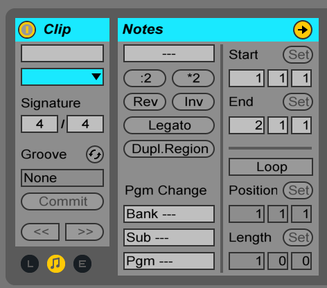

# Performing with Ableton Live: On Stage with St. Vincent

## Software Overview

1. Ableton Live
2. [Reason](https://www.propellerheads.se/en/reason) for software instruments
	* Contains huge rack of software instruments
	* Reason is great for some sounds although Ableton sound design capabilities are used just as much, if not more
3. Several plugins
	* [Diva](https://www.u-he.com/cms/diva): Recent favorite that is a virtual analog synthesizer
	* [Stringmachine](https://www.gforcesoftware.com/products/vsm): Great emulator for strings
	* [Arturia Mini V](https://www.arturia.com/products/analog-classics/mini-v/overview): moog emulator that is used quite a bit

## Ableton Live set layout

### Keeping the band and computer on the same page
* Two click tracks
* Recorded count off before each song starts
* Track for starting pitch reference in case the vocalist needs to come in before the music starts

### Instruments

* Separate tracks for each midi controller and drum trigger setup

### Program Change

Separate tracks just for program change messages that Mintseris uses to change the patches on the other musicians instruments from his keyboard (this is so they don't have to think about that stuff while they're interacting with the audience)

## Preparing to use a click

Sometimes you may not have a choice of using a click track during the show if there is any element in the music that requires the computer to be in sync with the band. Some examples include:

  * time defects
  * arpeggiators
  * most kinds of pre recorded audio if you're using it
  * patch change automation.

Ableton live has a metronome button in the toolbar, however having a dedicated click track offers more control. For example you can:

  * automate the volume of the click
  * more routing options (easily change the tonal character of the click or even create simple beat patterns to make the click a little more musical

Performers need to wear headphones or in-ear monitors

## Creating click tracks

Use a midi note to trigger the click.wav via a Simpler module. One this is done you can save. Drag the clip over to the browser, saving it as a template. From there you can drag and drop this template onto a MIDI track to create a click track. This lets you add them to other songs with different tempos. This is preferred since Live won't have to warp the audio, causing unecessary cpu processing.

I can also automate the click volume, so that it is louder during the chorus but soft during the verse.

## Count-off and starting pitch

Count-off

Record yourself counting 1,2,3,4 and bounce them into four individual tracks. From there create a `COUNT` track and drag in Impulse onto a MIDI track.
	* Impulse is designed for drum programming, but for ourpurposes it's just a sampler with eight sample slots.

	
### Starting Pitch

Unless the singer has perfect pitch, there has to be some frame of reference if they're starting a song with just vocals

1. Drag the `Operator` instrument onto a track (which will automatically create a MIDI track).

# Keyboard Presets

## Creating a song preset is an Instrument Rack

1. Create a new MIDI track (cmd + shift + t)
2. Specify controller input via the `MIDI From` dropdown menu on the track and select the midi channel below that
3. Turn on monitoring
4. Name the track (cmd + r)

> I will use the idea of chains layered within racks to build all my presets.

You can group the existing devices with a new one, you can add it to the chain, select all devices and hit `cmd + g` to group

Grouping devices into a chain creates a new rack that contains that chain

## Switching sounds within the song preset

## Using clip automation to switch sounds

MIDI track with chain selector automation envelope. Clips like this that have no media or audio in them an donly exist to perform other functions are often called dummy clips.

## Using a macro to conserve CPU and select song presets

> The chain selector of the master rack is in charge of routing incoming MIDI to the chain for the current song. You can see that if you watch these input meters as I move the chain selector and hear the sounds change. However, even though the rest of the racks aren't receiving MIDI the devices in the entire set are still active. They don't consume as much power as when they're being used, but they still waste lots of precious processing cycles just by being on.

What you really want when selecting a song is two things:

1. Enable MIDI to the appropriate chain with the chain selector
2. Activate the chains devices by using the racks device activator button in its upper left corner

Whenever more than one action needs to be performed on a master rack, you can use that rack's "Macro controls"

Replace the chain selector with the Rack Activator macro. This will do the chain selector's job and save CPU resources by enabling the track racks only when they're needed.

## Automating song presets at song start

Use a Rack Activator macro to turn on/off instrument racks on song start. This can conserve CPU resources, especially if you have a lot of different parts/effects.

## The Drumset as a MIDI controller

### Ableton Drum presets

The drum controller can act in much the same way as the keyboard controller we've been using up until this point, except the samples and device chains will be contained in `Drum Racks` instead of `Instrument Rocks`

You can start with a generic drum rack (Drums > Drum Rack)

Ableton will create a new midi track for the drum rack

## Remote Control From Ableton

### Guitar stations and Moog bass

MIDI switching the patches from my keyboard using a "long MIDI cable"

This switch can happen at the beginning of the song or several times per song if necessary. Sometimes 5 or 6 songs are used in a single song.

At toko's station, she uses a mimimoog Voyager hooked into a guitar pedal board since she doubles on guitar and bass duties.

The same MIDI cable allows me to play Toko's Moog. So when toko is busy playing a guitar part, I can take over and play the bass from her Moog Voyager, either with my feet or on my keyboard controller.

MIDI was invented and standardized to allow for instruments to be connected together.

The MIDI protocol can get archane and achaic pretty quickly.

#### Program Change

Program Change is one of it's most basic functions

1. Create a MIDI track for the sole purpose of Program Change events
2. Change the `MIDI From` dropdown to `No Input` just to make sure none of the input from the other controllers end up on that channel.
3. Set the `MIDI To` dropdown to the interface that is being used to communicate with the external instrument. So from your MIDI interface, you connect a cable from MIDI OUT to the MIDI IN connection on the device. Set the channel (make sure both devices are set to the same channel).
4. Create an empty MIDI clip on that MIDI channel/track by double clicking on an empty clip box.
5. Turn off LOOP since it only needs to fire once.
6. There is a program change section in the Notes box
  
7. Changing the program number changes the preset on the device, usually this is the only field you need to modify.
8. 
