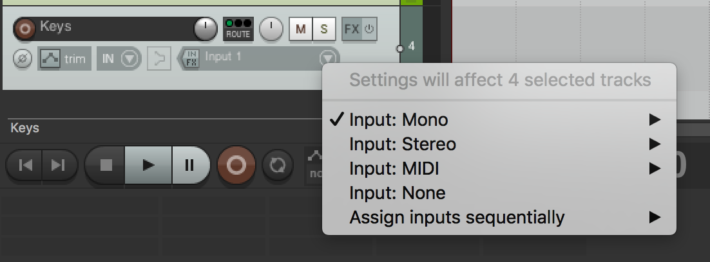

# Learning REAPER 5

## Getting Started with the REAPER Interface

### Setting up the appearance and layout

Options > Themes
Options > Layouts

### Understanding the menus and toolbars

Starting at top left, important bits

* New Project
* Open Project
* Save Project
* Project Settings
* Metronome
	* Can setup whether there is a count-in

The next row has to do with the media items and how they behave

You can add/remove buttons from the toolbar by right clicking the space next to it and clicking "Customize toolbar"

* The Normalize button might be good for beginners

### Working with tracks and the transport

* Grid snapping
* Red line is the playhead
* Spacebar is a pretty universal way to start/stop a track
* Zooming in and out in the grid
	* scroll wheel zooms horizontally by default if your mouse is in the media grid
	* hold ctrl (or cmd) to scroll vertically
* Track controls
	* Arm for recording
	* Rename tracks
* Transport controls
	* Record, play, stop, and loop
	* BPM
	* Time signature

### Working with windows and docking

* Mixer and faders for each track
* You can dock/undock windows by going to View > choosing a tool to view, right clicking on that tool and sending it to the dock

### Setting up a new project

To make our lives easier go to:

Reaper > Preferences > Project menu > Check the box that says "Prompt to save on new project"

This forces us to name and place the project when we start a new one which can be nice to get out of the way and just stay in your flow once you start a project

Strongly recommended when you start a new project is to click the "Create subdirectory for this project" and the "Copy all media into project directory"

When you start a new project, it's a good idea to set everything up before you start recording or adding new media

Click the "Project Settings" button from the toolbar (top row, 4th from left)

* In Project settings you can adjust Sample Rate
	* 44100 is perfectly fine for beginner projects
	* You can also set BPM and Time Signature

Once you set up the project settings the first time you can go back to the Project settings and save it as the default so you don't have to set it up again

### Backing up your project

### Improving workflow with templates

* Select all tracks after adding them, right-click and go to Track color > Set tracks to random colors
	* it's easier to differentiate the tracks when they're color coded
* File > Project Templates > Save Project as template
* From that point you can go to File > Project Templates > And choose the template you'd want to use

## Recording and Importing Media

### Setting up your inputs

Before we can start recording we need to set up our inputs/devices (e.g usb interface, microphone, built in inputs)

REAPER > Preferences > (Audio tab > Device) > then select your device from the Audio Device dropdown

(Note: On a windows machine you have to select the driver as well (which will usually be ASIO)

Once that is setup, we're ready to map our tracks to the proper channels and start recording

### Recording audio

1. First thing we do is create a new track (Cmd + T)
2. Rename your track before you start recording so that when it saves the file it's not a random number
  
3. Now that the inputs are setup, you can set the level
	* -18 to -12 is good, you never want to peak (where it hits red/0). -18 to -12 gives you headroom to work with

