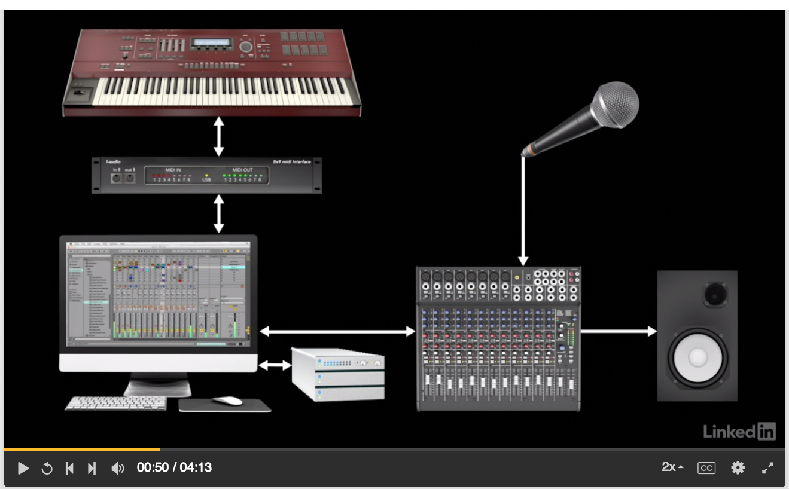

# Ableton Live 9 Essential Training

Components of an audio setup

## 2. Software Setup and Preferences

### Setting up audio preferences

### Setting up MIDI Preferences

### Optimizing Performance

## 3. Session View

### Nonlinear sequencing with Session view

Rules:

1. Only 1 click can play on a single track at a time

### Understanding the Session view window

### Exploring the Live browser

### Loading and playing clips

## 5. Recording MIDI

### Software Instrument

